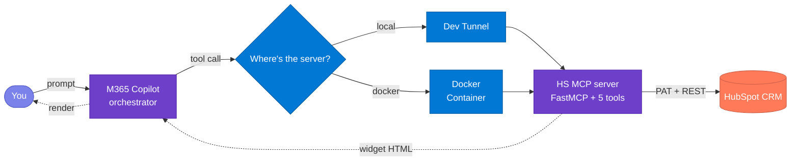

# Ask - HubSpot

> Drop your HubSpot CRM into Microsoft 365 Copilot. Ask questions in plain English, get back live interactive widgets right inside the chat.

- 🪟 Live widgets render inline in chat
- ✏️ Read / create / update Companies with multi-field filtering
- 🔗 Picklist-aware forms — type, lifecycle stage, city, country
- 💻 Local laptop or ☁️ Docker container
- ⚡ One-command deploy

<p align="center">
  
  
  
  
  
  
  
</p>

**Jump to:** [What this is](#1-what-this-is) · [How it works](#2-how-it-works) · [Install](#3-install) · [Troubleshooting](#4-troubleshooting)

---

## 1. What this is

**Ask - HubSpot** brings your HubSpot CRM straight into Microsoft 365 Copilot. Type something like *"show me companies"* or *"create a new company called Contoso"* and a **live, interactive widget** renders right inside the chat — **no tab switching, no context loss**. You can read records, create new ones, update what's there, and filter by multiple fields, all from the Copilot side panel.

> [!TIP]
> Works with any HubSpot account that has API access — free, Starter, Professional, or Enterprise.

Two ways to run it:

- 💻 **Local** — your laptop is the backend, exposed via dev tunnel. **Fast iteration** while you tweak.
- 🐳 **Docker** — same code in a container. **Stays online** without your laptop open.



---

## 2. How it works

The app implements **five tools** that cover the core CRM operations for the Companies entity, plus company drill-downs for associated contacts and deals.

### 2.1 Operations

| # | Operation | What you say | What happens |
|---|---|---|---|
| 1 | **GET** | "show me companies" | Lists the 10 most recent companies |
| 2 | **FILTER** | "prospect companies" / "companies in London" | Narrows by name, domain, type, lifecycle stage, city, or country |
| 3 | **IDENTIFY** | "show company Evolt Active" | Fetches that specific company |
| 4 | **EDIT** | "edit Evolt Active" | Opens the record with an edit form (all 8 fields) |
| 5 | **CREATE** | "create company Contoso, type PROSPECT, city Seattle" | Pre-filled form — complete and submit |

### 2.2 Companies fields

| Field | Filter | List view | Edit / Create |
|---|---|---|---|
| Name | ✓ text search | ✓ | ✓ (required) |
| Domain | ✓ text search | ✓ | ✓ |
| Type | ✓ picklist | ✓ | ✓ |
| Lifecycle Stage | ✓ picklist | ✓ | ✓ |
| City | ✓ text search | ✓ | ✓ |
| Phone | — | — | ✓ |
| Country | ✓ text search | — | ✓ |
| Description | — | — | ✓ |

**Picklist values:**
- **Type:** `PROSPECT`, `PARTNER`, `RESELLER`, `VENDOR`, `OTHER`
- **Lifecycle Stage:** `subscriber`, `lead`, `marketingqualifiedlead`, `salesqualifiedlead`, `opportunity`, `customer`, `evangelist`, `other`

### 2.3 In action

#### GET — list companies

Ask for companies. The agent returns the most recent records as a sortable table with Edit / New controls.

#### FILTER — narrow the list

Add conditions — *"prospect companies"*, *"companies in London"*, *"customer lifecycle stage"*. The agent maps your natural language to the correct HubSpot filter operators (`CONTAINS_TOKEN` for text, `EQ` for picklists).

#### EDIT — modify a record

Say *"edit Evolt Active"*. If one match, the edit form opens directly with all 8 fields pre-filled. If multiple matches, the list is shown so you can pick the right one.

#### CREATE — open a pre-filled form

The agent picks values from your sentence — name, type, city — and pre-fills the create form. Review, complete remaining fields, and submit.

---

## 3. Install

Three steps: clone → configure → run locally. About 15 minutes end-to-end.

### Step 1 — Clone the repo

```powershell
git clone https://github.com/microsoft/mcp-interactiveUI-samples.git
cd mcp-interactiveUI-samples/mcp-apps/hubspot-crm/python
```

**Validate:** You should see `hs_crm_mcp/`, `shared_mcp/`, `widgets/`, `deploy/`, and `agent/` directories.

---

### Step 2 — Get your HubSpot credentials

You need a **Private App Token** from your HubSpot account.

1. Go to **Settings → Integrations → Private Apps** in HubSpot.
2. Click **Create a private app**.
3. Give it a name (e.g. "M365 Copilot MCP").
4. Under **Scopes**, add: `crm.objects.companies.read`, `crm.objects.companies.write`.
5. Click **Create app** and copy the token.

> [!IMPORTANT]
> The token starts with `pat-na2-...` (or similar depending on your region). Keep it safe — it grants API access to your CRM data.

**Validate:** You have your Private App Token copied.

---

### Step 3 — Run locally

**Prerequisites** (install these first):

- 🐍 **Python ≥ 3.11**
- 📦 **Node.js ≥ 18** (for widget build)
- 🌐 **[Dev Tunnels CLI](https://learn.microsoft.com/azure/developer/dev-tunnels/get-started)** — run `devtunnel user login` once
- 🛠️ **[M365 Agents Toolkit](https://aka.ms/teamsfx)** (VS Code extension)
- 🏢 **M365 dev tenant** with **Custom App Upload Enabled** and **Copilot Access Enabled**

**Action:** Copy `.env.example` to `.env` in the project root, then fill in your token:

| Param | Value |
|---|---|
| `HUBSPOT_ACCESS_TOKEN` | Your Private App Token (e.g. `pat-na2-...`) |
| `PORT` | *(optional)* Server port, default `8082` |
| `APPINSIGHTS_CONNECTION_STRING` | *(optional)* App Insights for telemetry |

Then run:
```powershell
.\deploy\LocalDeploy.ps1
```

The script takes 3–4 minutes the first time:
1. 🐍 Python venv + dependencies (~60s)
2. ⚛️ React widget bundle (~45s)
3. 🚀 MCP server on `:8082` (~3s)
4. 🌐 Dev tunnel with public HTTPS URL (~5s)
5. 📤 Agent package uploads to M365 (~15s, device-code sign-in first time)

**Validate:**
1. The terminal shows the LIVE banner:
```text
  =====================================
   ASK - HUBSPOT CRM COPILOT LIVE
  =====================================
  Server  -->  http://localhost:8082
  Tunnel  -->  https://<id>-8082.inc1.devtunnels.ms
  MOS3    -->  agent package live in M365 Copilot
```
2. Test the server:
```powershell
curl -X POST http://localhost:8082/mcp -H "Content-Type: application/json" -d '{"jsonrpc":"2.0","method":"initialize","id":1}'
```
You should get a JSON-RPC response.
3. Open M365 Copilot → pick **Ask - HubSpot** from the agent picker.
4. Try *"show me companies"* — a widget should render with a company list.

> [!TIP]
> If the agent doesn't appear in the picker, wait 1–2 minutes and refresh.

---

### Step 4 — Run with Docker (optional)

```powershell
cd mcp-apps/hubspot-crm/python
docker build -t hs-mcp-copilot .
docker run -p 8082:8082 -e HUBSPOT_ACCESS_TOKEN=pat-na2-... hs-mcp-copilot
```

---

## 4. Troubleshooting

### Agent & Copilot

- **Agent missing from the picker** — Wait 1–2 minutes after upload, then refresh. Check that Custom App Upload is enabled in M365 admin.
- **"Oops! Something went wrong"** — Dev tunnel dropped momentarily. Wait 5–10 seconds and re-send.
- **Widget doesn't render** — Confirm the server is running and responding at `/mcp`.

### HubSpot connection

- **`401 Unauthorized`** — Token is invalid or expired. Regenerate in HubSpot Settings → Private Apps.
- **Empty results** — Your Private App may be missing CRM scopes. Add `crm.objects.companies.read` and `crm.objects.companies.write`.

### MCP server

- **`/mcp` returns 421 "Invalid Host header"** — DNS rebinding protection. Already disabled in this codebase via `enable_dns_rebinding_protection=False`.
- **Unicode errors on Windows** — Set `PYTHONIOENCODING=utf-8` before running the server.
- **Port in use** — Another process is on 8082. Kill it or change `PORT` in `.env`.

### Common questions

- **Can I run without Docker?** — Yes. Fill `.env`, run `LocalDeploy.ps1`. Dev tunnel handles the rest.
- **How do I add Contacts/Deals/Tickets?** — Add three functions to `hs_crm_mcp/hubspot_tools.py` (`get`/`create`/`update`), add the schema to `_ENTITY_SCHEMAS`, register with the server, re-run deploy.
- **Is this production-ready?** — It's a reference implementation for demos and pilots. For production: move secrets to Key Vault, switch to OAuth, add audit logging and rate limiting.
